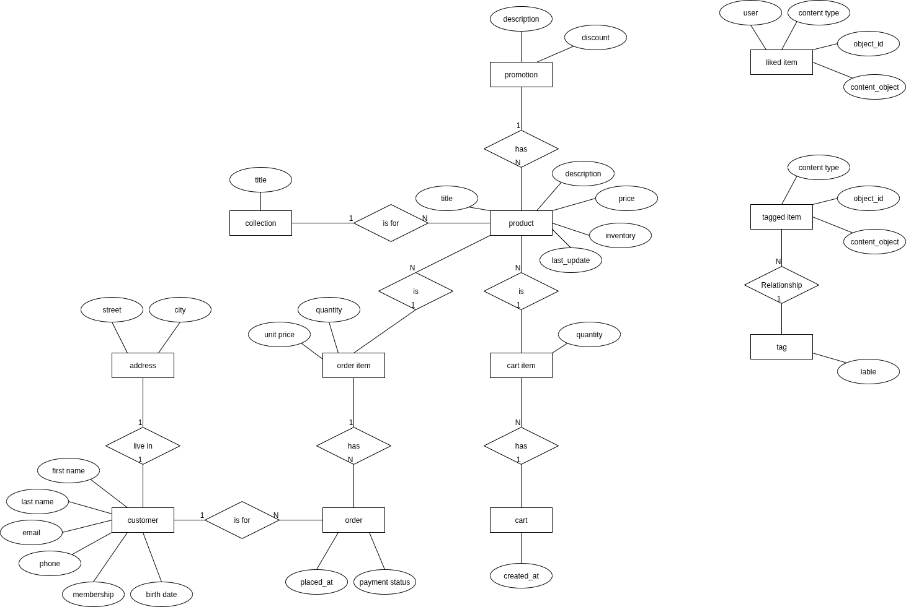

# Backend E-commerce Django API


This project is the result of completing **[The Ultimate Django Series](https://codewithmosh.com/p/the-ultimate-django-series)** by *[Mosh Hamedani](https://codewithmosh.com/)*.  
It demonstrates a **production-ready backend architecture** for an e-commerce system and reflects the practical skills and best practices learned throughout all three parts of the course.

TODO explain the app structure and what each do
## 🧠 Key Concepts, Features
TODO seprated app logic - and explain about it
TODO reorder this to a better format
### 🗄 Database Design & ORM

* Relational database design for an e-commerce system
* Query optimization using `select_related` and `prefetch_related`

### 📦 File & Image Handling

* Product image uploads and media management
* File and image validation (custome and django validation)

### 🔐 Authentication & Authorization
TODO check the jwt line
* Django authentication system
* Custom user model
* Token-based authentication and permissions (JWT)

### 🧩 Django Admin Customization

* Admin panel customization
* Custom list views, search, filters, and inline models

### 🔔 Signals & Business Logic

* Custom Django signals
* Automated creation of related objects

### 🌐 REST APIs (Django REST Framework)

* REST API development using DRF
* Pagination, filtering, searching, and ordering

### 🛒 E-commerce Core Features

* Product catalog and shopping cart
* Order workflow and price validation

### 🧪 Testing & Code Quality

* Automated testing with pytest
* Testing models, APIs, and permissions

### ⚡ Performance & Background Tasks
TODO redis for caching and message broker
docker run -d -p 6379:6379 redis
* Redis caching
* Background processing with Celery
TODO celery commands
celery -A storefront worker --loglevel=info
TODO working with flower for monitoring
celery -A storefront flower

### 📬 Email & Background Services
TODO mentioned the repo and tell the admin panel in localhost:5000

* Email sending with a Dockerized SMTP server (smtp4dev)
* Local email testing without real SMTP providers

### 🐳 Docker & Development Environment

* Docker-based development setup
* Isolated and reproducible environments


## 🗂 ER Model (Database Design)
TODO update this er model


## 🛠 Prerequisites

Make sure you have the following installed:

- Python 3.10+  
- pip  
- Virtual environment tool (`venv` or `virtualenv`)  
- MySQL (or Postgres) configured for your Django project
- TODO docker

## 📦 Installation
TODO commands for runing smtp service using docker
  docker pull rnwood/smtp4dev
  docker run --rm -it -p 5000:80 -p 2525:25 -p 110:110 rnwood/smtp4dev
  see admin panel in localhost:5000
1. **Clone this repo**

```bash
   git clone https://github.com/your-username/ultimate-django.git
   cd ultimate-django
```

2. **Create and activate a virtual environment**

   ```bash
   python -m venv venv
   source venv/bin/activate   # macOS/Linux
   venv\Scripts\activate      # Windows
   ```

3. **Install dependencies**

   ```bash
   pip install -r requirements.txt
   ```

4. **Set environment variables**

   Create a `.env` file and add your secret settings (e.g., `SECRET_KEY`, database credentials).

5. **Run migrations**

   ```bash
   python manage.py migrate
   ```

6. **Run the development server**

   ```bash
   python manage.py runserver
   ```

## 📌 API Usage

Once the server is running, visit:
TODO fix this apis
```
http://localhost:8000/api/
http://localhost:8000/admin/
```

Use your favorite API client (e.g., Postman, Insomnia) to test endpoints.

## 🧪 Running Tests

To run the test suite:

```bash
pytest
```


TODO find answer to this question before ending this project
  what is diffrent between genric, apiview and viewset
  what is __init__ doing?
    and why we import celey in it?
  what is the structure and endpoints like and means here?
  